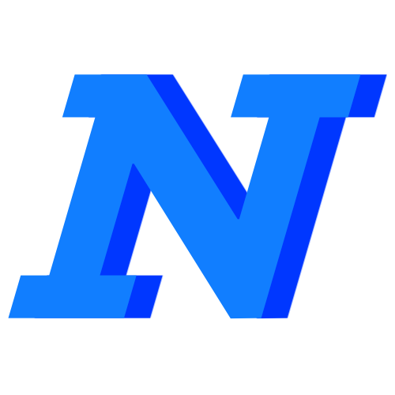

<p align="center">
    
</p>
<h1 align="center"> NextNotes </h1> <br>
<p align="center">
   A free, open-source notes app that syncs with Nextcloud Notes
</p>


<p align="center">
    
    
    
    
## Features

* Out of the Box Nextcloud Notes Sync
* Dark / Light Theme
* add Notes
* edit and update Notes
* delete Notes
* mark note as Favourite

## Installation


## Contribution

* Fork this Project

* Git clone

* ``` cd NextNotes && flutter run ``` 

* make changes to code

* Pull request ;)

  

  

   
