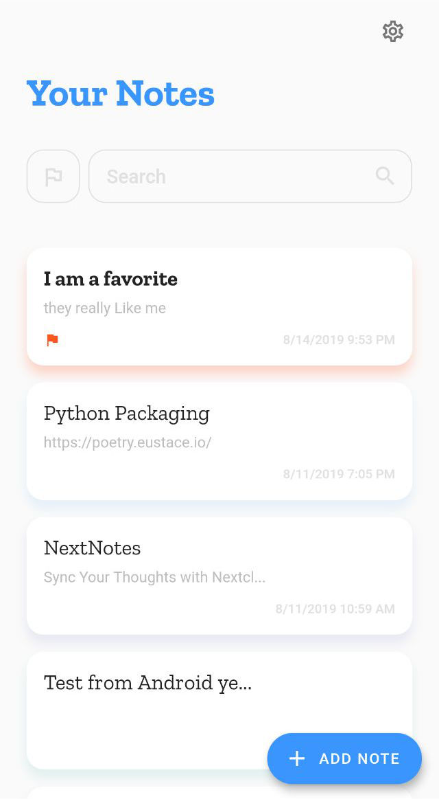
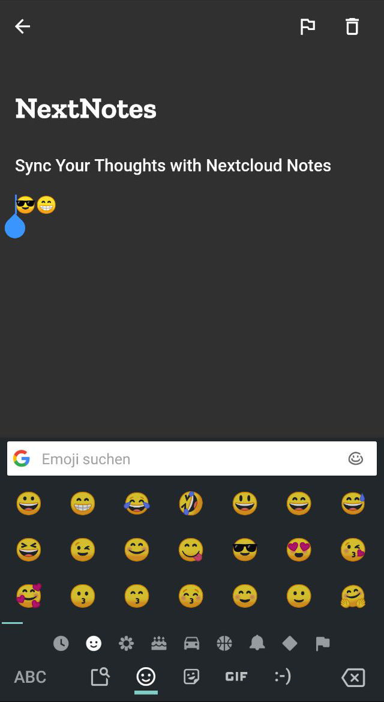

<h1 align="center"> This is a Alpha and not yet fully usable </h1> 


<p align="center">
  


<h1 align="center"> NextNotes </h1> <br>
<p align="center">
   A free, open-source notes app that syncs with Nextcloud Notes
</p>


<p align="center">
    
    
    
    

<p align="center">
	    
	     <br><br><br>
<p align="center">
  			<a href="https://github.com/daehruoydeef/NextNotes/releases">
	    <a/><br><br><br>


## Features

* Out of the Box Nextcloud Notes Sync
* Dark / Light Theme
* add Notes
* edit and update Notes
* delete Notes
* mark note as Favourite

## Roadmap

* add Markdown for Preview
* implement categories
* add Password field autofill in
* add Splashscreen animation

## Contribution

* Fork this Project

* Git clone

* ``` cd NextNotes && flutter run ``` 

* make changes to code

* Pull request 


## Credit
Thanks to [roshanrahman](https://github.com/roshanrahman) and his [Flutter Notes UI](https://github.com/roshanrahman/flutter-notes-app) for the inspiration and original design.

  

  

   
